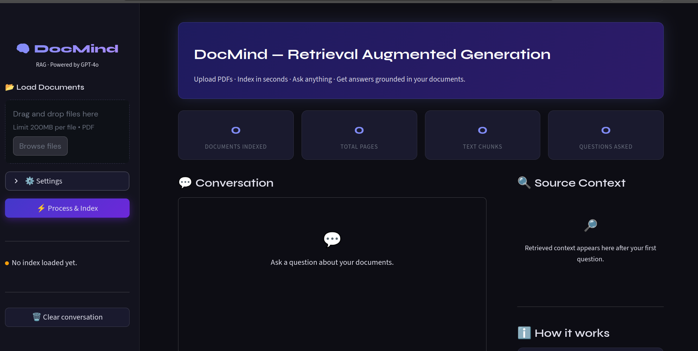
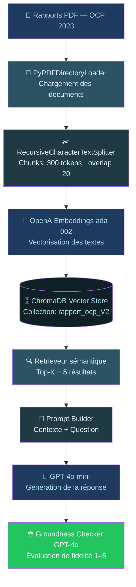

<div align="center">

<!-- ANIMATED HEADER -->


<!-- ANIMATED BADGES -->
<p align="center">
  
</p>

<br/>

[](https://python.org)
[](https://python.langchain.com/)
[](https://openai.com/)
[](https://trychroma.com)
[](LICENSE)

<br/>

> **✨ Et si lire un rapport financier devenait une conversation ?**
>
> *Transformez des centaines de pages PDF en interface conversationnelle intelligente.*

</div>

---

## 🌟 Aperçu

<table>
<tr>
<td width="50%">

### 📄 Chargement des documents


</td>
<td width="50%">

### 💬 Chat contextuel


</td>
</tr>
</table>

<div align="center">

### 🖥️ Dashboard complet


</div>

---

## 🧠 Comment ça marche ?



---

## 🚀 Stack Technologique

<div align="center">

| Composant | Technologie | Rôle |
|-----------|-------------|------|
| 🔗 **Orchestration** | LangChain | Pipeline RAG complet |
| 🤖 **LLM** | GPT-4o / GPT-4o-mini | Génération & Évaluation |
| 🧮 **Embeddings** | text-embedding-ada-002 | Vectorisation des chunks |
| 🗄️ **Vector Store** | ChromaDB | Stockage & recherche |
| 📄 **Extraction PDF** | PyPDFLoader | Chargement des documents |
| ⚖️ **Évaluation** | LLM-as-a-Judge | Score de groundness |

</div>

---

## 📦 Installation

### 1️⃣ Cloner le dépôt

```bash
git clone https://github.com/Ramadiaw12/rag_project.git
cd rag_project
```

### 2️⃣ Créer l'environnement virtuel

```bash
python -m venv venv
source venv/bin/activate        # Linux / macOS
# venv\Scripts\activate         # Windows
```

### 3️⃣ Installer les dépendances

```bash
pip install -r requirements.txt
```

### 4️⃣ Configurer les variables d'environnement

```bash
cp .env.example .env
# Ouvrez .env et ajoutez votre clé OpenAI
```

### 5️⃣ Placer vos PDFs

```bash
mkdir -p pdfs
# Copiez vos rapports OCP dans pdfs/
```

---

## ⚙️ Configuration

```env
# .env — Variables d'environnement

# 🔑 Obligatoire
OPENAI_API_KEY=sk-xxxxxxxxxxxxxxxxxxxxxxxxxxxxxxxx

# 📡 Optionnel — LangSmith tracing
LANGCHAIN_API_KEY=ls_xxxxxxxxxxxxxxxxxxxx
LANGCHAIN_PROJECT=rag-ocp-financial
LANGCHAIN_TRACING_V2=true

# ⚙️ Paramètres RAG
CHUNK_SIZE=300
CHUNK_OVERLAP=20
TOP_K_RESULTS=5
MAX_CONTEXT_TOKENS=4000

# 🐛 Debug
DEBUG=false
LOG_LEVEL=INFO
```

---

## 💡 Utilisation

### Initialisation de la base vectorielle

```python
from rag_pipeline import initialize_vectorstore

vectorstore = initialize_vectorstore("./pdfs", force_recreate=False)
```

### Interrogation simple

```python
from rag_pipeline import RAG

response = RAG("Quel est le chiffre d'affaires de l'OCP en 2023 ?")
print(response)
```

### Mode interactif

```python
from rag_pipeline import interactive_qa

interactive_qa()
```

### Évaluation automatique

```python
from evaluation import evaluate_with_metrics

metrics = evaluate_with_metrics("Quelles sont les performances financières ?")
print(f"Score groundness : {metrics['score']}/5")
```

---

## 📊 Exemples de résultats

```
🔍 Q : Quel est le chiffre d'affaires de l'OCP en 2023 ?
📝 R : Le chiffre d'affaires consolidé s'établit à 87,4 milliards de dirhams...

🔍 Q : Comment a évolué l'EBITDA par rapport à 2022 ?
📝 R : Le résultat net part du groupe s'élève à 28,1 milliards de dirhams...

🔍 Q : Je veux dormir (hors contexte)
📝 R : JE NE SAIS PAS
```

---

## ✨ Fonctionnalités

### ✅ Disponibles

| # | Fonctionnalité | Description |
|---|----------------|-------------|
| 🔍 | **Recherche sémantique** | Similarité cosinus via embeddings |
| 🤖 | **Génération RAG** | Réponses contextuelles avec GPT-4o-mini |
| 📄 | **Multi-PDF** | Traitement de tous les PDFs d'un dossier |
| ⚖️ | **Auto-évaluation** | Groundness checker avec GPT-4o |
| 💾 | **Persistance** | Sauvegarde / rechargement Chroma |
| 🔄 | **Lazy loading** | Traitement mémoire optimisé |

### 🚧 En développement

| # | Fonctionnalité | Description |
|---|----------------|-------------|
| 🎯 | Filtrage par métadonnées | Recherche par source/page |
| 📊 | Scores de similarité | Visualisation des scores de retrieval |
| 🔁 | Mode conversationnel | Historique de questions multi-tour |
| 🌐 | API REST FastAPI | Exposition du pipeline via API |
| 📱 | Interface Streamlit | UI utilisateur interactive |

---

## 📊 Métriques d'évaluation

<div align="center">

| Métrique | Échelle | Description |
|----------|---------|-------------|
| 🏆 **Groundness** | 1 → 5 | Fidélité de la réponse au contexte |
| 🚨 **Hallucinations** | Liste | Infos non présentes dans les docs |
| 📐 **Couverture** | 0 → 100% | Proportion de la question répondue |
| 🎯 **Pertinence** | 1 → 5 | Adéquation réponse / question |

</div>

**Exemple de rapport JSON :**

```json
{
  "question": "Quel est le chiffre d'affaires 2023 ?",
  "score": 5,
  "hallucinations": [],
  "faithfulness": true,
  "explanation": "La réponse cite exactement les 87,4 Mds MAD du contexte",
  "context_length": 1250,
  "answer_length": 187,
  "processing_time": 2.3
}
```

---

## 💰 Estimation des coûts OpenAI

| Modèle | Usage | Coût indicatif |
|--------|-------|----------------|
| `gpt-4o-mini` | Génération RAG | $0.15 / 1M tokens (input) |
| `gpt-4o` | Groundness checker | $5.00 / 1M tokens (input) |
| `text-embedding-ada-002` | Vectorisation | $0.13 / 1M tokens |

> 💡 Un rapport de ~200 pages ≈ 1000–1500 chunks ≈ **~$0.15 d'embeddings**

---

## 🗂️ Structure du projet

```
rag_project/
├── 📄 .env                    # Variables d'environnement
├── 📄 .env.example            # Template de configuration
├── 📄 .gitignore
├── 📄 requirements.txt
├── 📄 main.py                 # Point d'entrée principal
├── 📄 rag.py                  # Dashboard Streamlit
├── 📓 RAGV2.ipynb             # Notebook de développement
├── 📁 pdfs/                   # Rapports PDF sources
│   └── Rapport Financier OCP 2023.pdf
├── 📁 store/                  # Base vectorielle Chroma (générée)
└── 📄 README.md
```

---

## 🤝 Contribuer

Les contributions sont les bienvenues ! 🎉

```bash
# 1. Forkez le projet
# 2. Créez votre branche
git checkout -b feature/nouvelle-fonctionnalite

# 3. Commitez vos changements
git commit -m "feat: ajout de la fonctionnalité X"

# 4. Pushez vers votre fork
git push origin feature/nouvelle-fonctionnalite

# 5. Ouvrez une Pull Request 🚀
```

### 🗺️ Roadmap

- [ ] 📊 Interface Streamlit complète
- [ ] 🌐 API REST avec FastAPI
- [ ] 🔁 Mode conversationnel multi-tour
- [ ] 📂 Support Excel & Word
- [ ] 🌍 Support multilingue (FR / EN / AR)
- [ ] 🎯 Fine-tuning sur données financières
- [ ] 🐋 Dockerisation complète

---

## 📄 Licence

Distribué sous la licence **MIT**. Voir [`LICENSE`](LICENSE) pour plus d'informations.

---

<div align="center">

### 🙏 Remerciements

[](https://python.langchain.com/)
[](https://openai.com/)
[](https://trychroma.com)
[](https://www.ocpgroup.ma/)

<br/>

---

**Conçu avec ❤️ par [DIAWANE Ramatoulaye](https://github.com/Ramadiaw12)**

*"L'IA ne remplace pas l'analyste — elle lui donne des super-pouvoirs."*


</div>